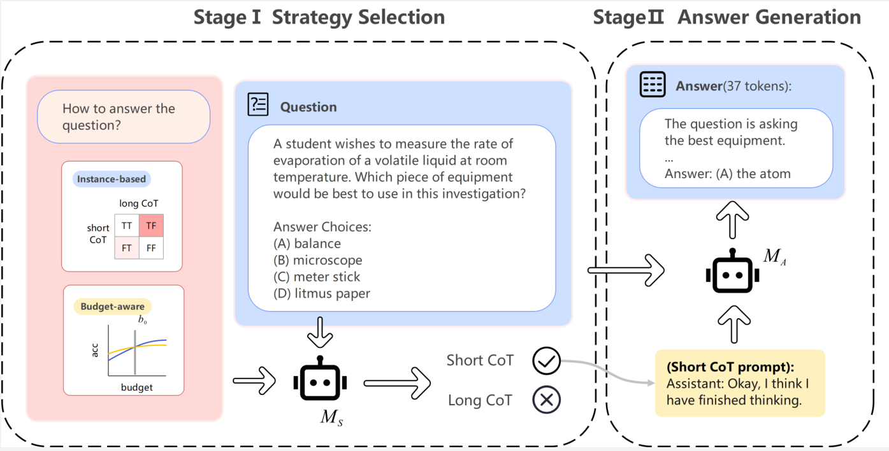

# SwitchCoT
Code for the article: Long or short CoT? Investigating Instance-level Switch of Large Reasoning Models




## Introduction

We propose a new method called SwitchCoT, which enables large reasoning models to automatically switch between generating long and short CoT at the instance level. SwitchCoT strikes a balance between reasoning effectiveness and computational efficiency. Furthermore, it is explicitly designed to be budget-aware, making it well-suited for scenarios where computational resources are constrained. 

Our approach is inspired by the dual-process theory in cognitive science, which posits that humans alternate between fast, intuitive thinking and slow, analytical reasoning depending on the context. Similarly, some instances are best handled through concise reasoning (short CoT), while others require more detailed analysis (long CoT). SwitchCoT emulates this adaptive capability, allowing LRMs to select the most suitable reasoning mode for each scenario.

We finally conduct experiments to demonstrate the substantial advantages of SwitchCoT. Results show that it can significantly reduce token consumption—by up to 50\%—on mathematical and sentiment analysis tasks. Importantly, this efficiency gain does not come at the expense of performance: SwitchCoT matches or even surpasses the accuracy of long CoT on various tasks, including outperforming it on knowledge-intensive and sentiment tasks.

## Installation

```bash
conda create -n switchcot
conda activate thinkless

cd switchcot

# For training
cd train
pip install -r requirements.txt

# For evaluation
cd evaluation
pip install -r requirements.txt
```


## Train

We train the strategy selection model to predict the optimal reasoning path based either solely on the input question or on a combination of the input and available external resources.

```bash
cd train

# solely based on the input 
llamafactory-cli train train_full\ds_7b_withoutbudget.yaml

# based on both the input and the available resources
llamafactory-cli train train_full\ds_7b_withbudget.yaml
```


## Evaluation

We leverage our strategy selection model to automatically determine the appropriate reasoning style, short CoT or long CoT, for each question in the test dataset. Given a test input, the model analyzes the question and predicts which reasoning strategy is more likely to produce an accurate and efficient answer. This prediction is then used to instantiate a corresponding prompt template, which guides the downstream answer generation process.

```bash
cd evaluation

python how_answer_eval.py --n_sampling 4
```


## Answer generation

The selected strategy is instantiated as a specific prompt template to guide the answer generation model.

Specifically, the short CoT strategy appends a concise marker — {`<think>` Okay, I think I have finished thinking. `</think>`} — to indicate minimal reasoning. In contrast, the long CoT strategy prepends the token {`<think>`} to prompt the model to perform more detailed, step-by-step reasoning.

```bash
cd evaluation
# Extract the strategies selected by the strategy selection model and convert them into prompts
python data/convert.py
# Generate the final answers using the prompts selected by the strategy selection model
python gen_answer.py --data_names allin_pred
```


## TODO List

1. [ ] Add paper link  

2. [ ] Add Quick Start guide  

3. [ ] Add case study examples  

4. [ ] Release the pretrained model


